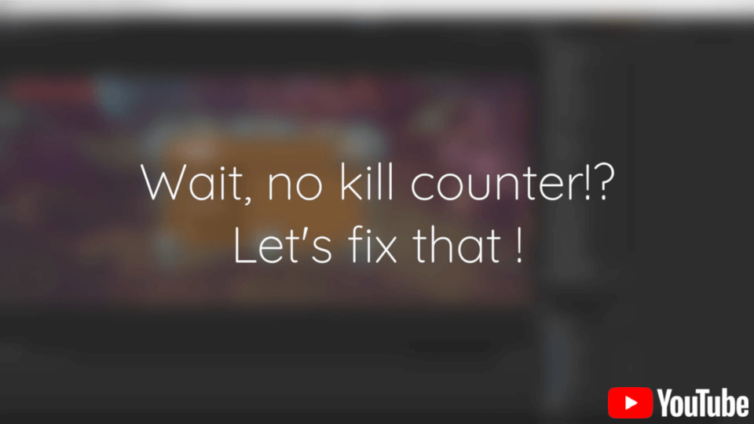

# Event System
Event system for Unity using ScriptableObjects based on the concept introduced by Ryan Hipple in his [talk](https://www.youtube.com/watch?v=raQ3iHhE_Kk) at Unite 2017.

## Why
Event systems and the observable pattern are very common in games and programs of every kind. So common that C# has it's own solution at the language level. Then why do we need yet another system? **Event System** makes the most out of the Unity Editor.

In **Event System** you can create the events and set all the listeners in the editor without writing any code.

 Many times we want to have global access to an event and being able to subscribe from anywhere but we would also like to avoid creating a singleton, with all its drawbacks, or have a stateful class exposed to every piece of code in our game. With **Event System** you can get a reference to your events as with any other asset in Unity and through the Unity Editor you can globally access any event without any major drawbacks.

In any observable pattern the main goal is to avoid letting the dispatcher know anything about the listeners. But, in many cases, the listeners end up knowing about the dispatcher anyway. In **Event System** both dispatcher and listeners are completely decoupled.

This last point comes with another possible advantage: using **Event System** it's trivial to dispatch an event from more than one place, which can be tricky in other solutions.

**Event System**  also makes it trivial to test events from the inspector when in Play Mode, making development iterations easier.

And finally, since events, are simply ScriptableObjects, it's very simple to create them programatically in runtime and use them like any other C# event (since the API is very minimal and similar).

## Installation
This package depends on [Core](https://github.com/lisandroct/Core). Both packages can be installed through the Unity Package Manager or by modifying the project packages manifest manually.
```
{
    "dependencies": {
        "com.lisandroct.core": "https://github.com/lisandroct/Core.git",
        "com.lisandroct.events": "https://github.com/lisandroct/EventSystem.git"
    }
}
```

## Demo
[](https://youtu.be/fPYVs0fG6IM)

## Usage
After installing **Event System**, the settings can be found in `Edit/Project Settings/Event System`. By default, the settings get generated with a few basic types for your convenience.


### Code generation
Before being able to use **Event System**, it's necessary to generate the required code for the different event types. In order to do so, under `Event Types` in settings, click `Generate` and all the necessary code will be generated automatically for you.

### Adding new event types
Each event can have up to four arguments. You can add new event types under `Add New` in settings.

To add a new type argument, search for it by filtering by namespace and/or type name and click on it. If you want to remove a previously added type, just click on it.


The event type will be automatically assigned a name from its argument types. You can change the name, but it's important to choose a name that was not used previously.

### Events
After generating the code, you can create event assets for every event type. Just right click in the Project Window and you'll see all the possible options under `Events`. The event will be automatically named `On[EventName]Event` but can be renamed.


In Unity, you can just get and use a reference to the new event like you do with any other type of asset.

In order to raise the event, every event has a `Raise` method.

#### Test events
One of the big benefits of using **Event System** over other solutions is that you can raise and test the events directly from the inspector while in Play Mode by selecting the asset in the Project Window.


#### Runtime events
Since events are just ScriptableObjects, it's super easy to create new events on runtime by just calling `ScriptableObject.CreateInstance<[EventType]>()` or `ScriptableObject.CreateInstance(typeof([EventType]))`.

### Listeners
There's nothing to prevent you from subscribing to events from code (by using the `Register` and `Unregister` methods) but **Event System** also provides you with Listeners for each event type you generate. Listeners are MonoBehaviours, so you have to attach them to a GameObject.


The listeners expect the reference to the event and call a UnityEvent when the event is raised.

## Example Scene
If this is your first time using the package, it's recommended to import the example from the Unity Package Manager. Note that the example contains the definition and code for Bool and Color events, in order to avoid conflicts, make sure to import the example before generating any **Event System** code by yourself.

## Important Note
**Event System** relies on the files saved and generated under `lisandroct` folder, it's important to not rename or modify any subfolder or file since everything was automatically generated and the whole system relies on it.